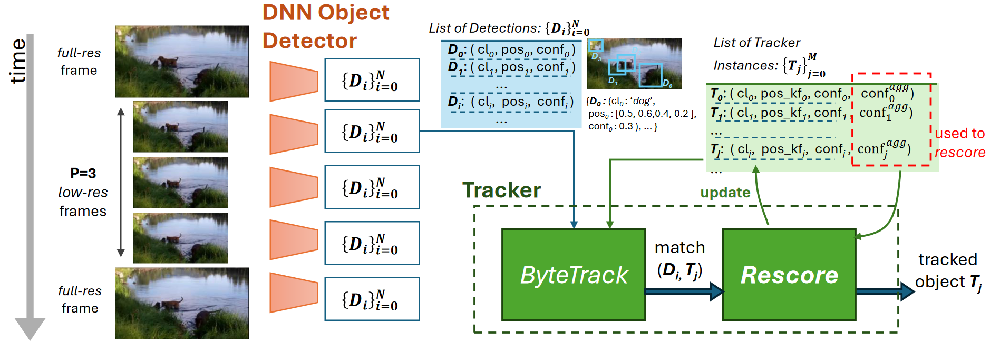

#     Multi_Resolution_Rescored_ByteTrack

The code in this repository is based on the code from [YOLOX](https://github.com/Megvii-BaseDetection/YOLOX),[YOLOV](https://github.com/YuHengsss/YOLOV/tree/master)and [ByteTrack](https://github.com/ifzhang/ByteTrack).\
We are happy to announce that our paper [Multi-resolution Rescored ByteTrack for Video Object Detection on Ultra-low-power Embedded Systems]() has been accepted at the Embedded Vision Workshop at the CVPR conference.\
In this repo the code to reproduce our results with MR2ByteTrack on the YOLOXS network. To do so you will need to:



- Install the dependencies you can either:
    - create a new environment using conda with the provided .yaml file ```shell conda -conda env create -f Multiresolution_ByteTrack.yml```
    - install the dependencies via pip with ```shell pip install -r requirements.txt``` we recoomend an environment with at least python version 3.8.16 installed later version should work. 
- Download the [weights](https://drive.google.com/file/d/1n8wkByqpHdrGy6z9fsoZpBtTa0I3JOcG/view?usp=sharing) of the YOLOXs network
- Download the ILSVRC2015 VID dataset from [IMAGENET](https://image-net.org/challenges/LSVRC/2015/2015-downloads)
    - unzip the dataset and keep the structure of the folder unchanged
- Modify the yolo_base_multisize.py file in the Experiments folder so that it cointains the directories for the ILSVRC2015 VID dataset, specifically:
    - change ```python self.val_dat_dir``` with the path to the Data VID folder contained in the ILSVRC2015 VID dataset folder
    - change ```self.val_ann_dir``` with the path to the Annotation VID folder contained in the ILSVRC2015 VID dataset folder
to run the experiment use :
    ```shell
     python -f=./BYTE_RESCORE/Experiments/BYTE_YOLOXS_multisize.py --b=1 -d=1 -c=path/to/the/yoloxs/weights
    ```
