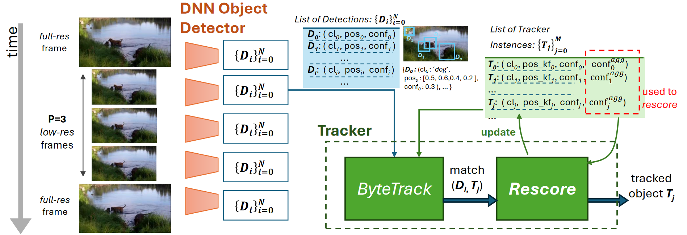

#     Multi_Resolution_Rescored_ByteTrack

The code in this repository is based on the code from [YOLOX](https://github.com/Megvii-BaseDetection/YOLOX), [YOLOV](https://github.com/YuHengsss/YOLOV/tree/master) and [ByteTrack](https://github.com/ifzhang/ByteTrack).\
In this repo the code to reproduce our results with MR2ByteTrack on the EffVIT-Det network. To do so you will need to:



- Install the dependencies you can either:
    - create a new environment using conda with the provided .yaml file ``` conda -conda env create -f Multiresolution_ByteTrack.yml```
    - install the dependencies via pip with ``` pip install -r requirements.txt``` we recommend an environment with at least python version 3.8.16 installed later version should work. 
- Download the ILSVRC2015 VID dataset from [IMAGENET](https://image-net.org/challenges/LSVRC/2015/2015-downloads)
    - unzip the dataset and keep the structure of the folder unchanged
- Modify the yolo_base_multisize.py file in the Experiments folder so that it cointains the directories for the ILSVRC2015 VID dataset, specifically:
    - change ``` self.val_dat_dir``` with the path to the Data VID folder contained in the ILSVRC2015 VID dataset folder
    - change ``` self.val_ann_dir``` with the path to the Annotation VID folder contained in the ILSVRC2015 VID dataset folder\
To reproduce the experiment with MR2-ByteTrack and the YOLOXS network run the command:
    ```shell
     python eval_multires.py -f=./Trainin_Library/Experiments/BYTE_Efficient_VIT_YOLOX_improved.py -c=path/to/the/Efficient_VIT_YOLOX/weights
    ```
    the -f option indicates the experiment that you are running and -c is used for loading pretrained weights from checkpoint. For an explanation of all the parameters see the file yolo_base_multisize.py.  

we also provide the weights of EffVIT-Det trained on the COCO dataset in the file EffVIT-Det.pth.  

Finally this repo also contains the C code for the deployment of the EffVIT-Det object detector in the folder EffViTDet_gap_9_execution_code

